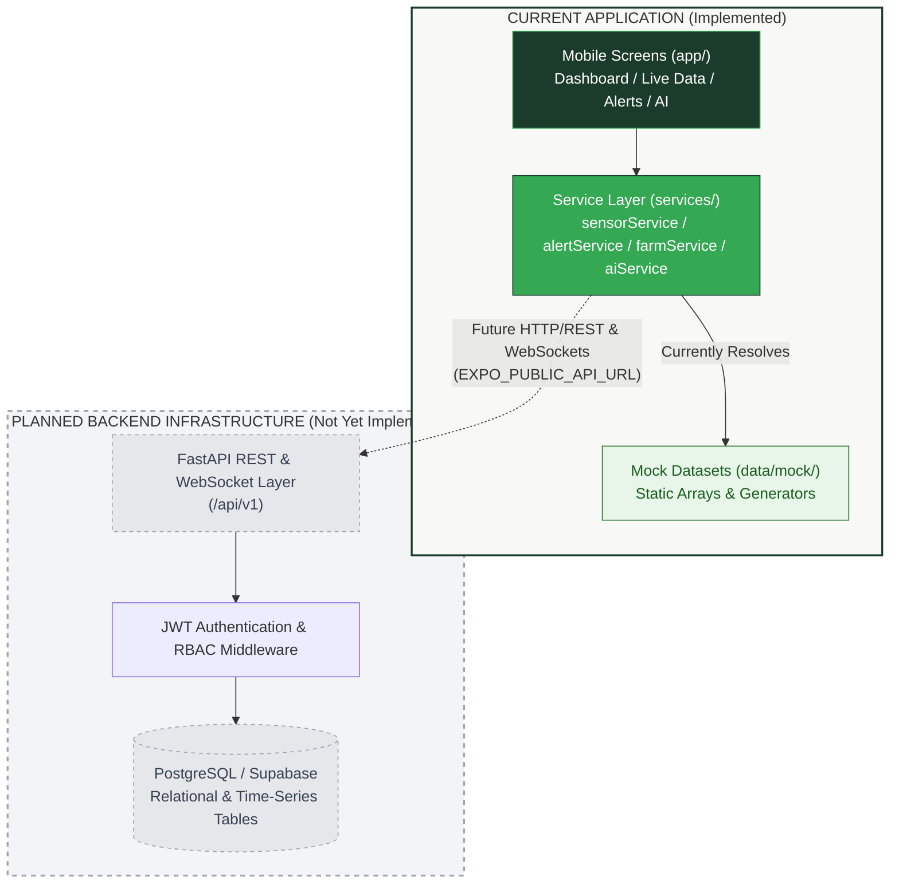
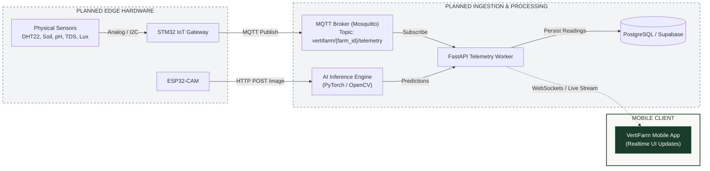
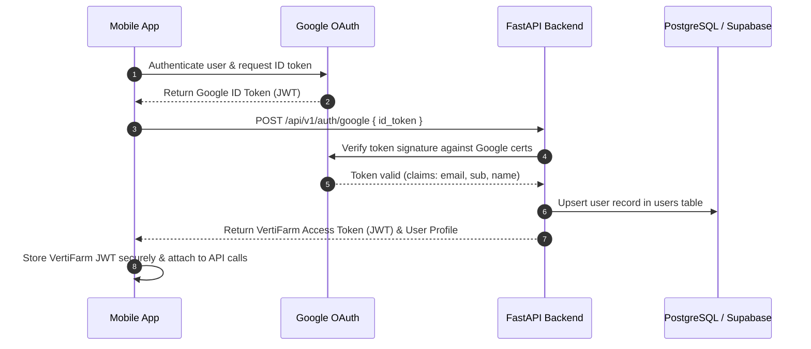

# VertiFarm API

## 1. API Overview

VertiFarm is currently a **client-side mobile application** operating in a **mock-first development mode**. As of today, there is no live backend REST API, database, or MQTT broker deployed.

To support rapid frontend engineering, screen validation, and UI polish, the application utilizes an internal **asynchronous service layer** located in `services/`. All user interface components interact with these typed service singletons, which return domain objects defined in [types/index.ts](file:///d:/farm-app/types/index.ts) using static and procedurally generated seed datasets in `data/mock/`.

### Current vs. Future API Architecture
- **Current State (Implemented):**
  - In-memory service abstraction layer (`services/authService.ts`, `services/sensorService.ts`, `services/alertService.ts`, `services/farmService.ts`, `services/aiService.ts`).
  - Artificial network latency simulation (100ms – 1000ms) to exercise loading states and asynchronous rendering.
  - Client-side Google OAuth 2.0 flow via `expo-auth-session` with client-side userinfo and ID token decoding.
  - Session persistence via `window.localStorage` on Web and in-memory fallback on native platforms.
  - Base API URL binding reserved in [constants/config.ts](file:///d:/farm-app/constants/config.ts) through `process.env.EXPO_PUBLIC_API_URL`.

- **Planned State (Future Architecture):**
  - Dedicated **FastAPI** REST backend server written in Python.
  - Centralized **PostgreSQL / Supabase** relational and time-series database.
  - **Eclipse Mosquitto** MQTT broker for low-latency ingestion of edge telemetry from STM32 gateway nodes.
  - Dedicated Python **AI Inference Service** for optical leaf disease analysis from ESP32-CAM images.
  - **WebSockets / Supabase Realtime** for push-based live telemetry updates to active mobile screens.
  - Push notifications delivered via Expo Push Notification Service (FCM/APNs) for automated alert dispatches.

---

## 2. Current Service Layer

The mobile application's service layer serves as an adapter between UI components and data sources. When the backend is developed, only the internal implementation of these services will change from mock data returns to network requests.

### 2.1 `authService` ([services/authService.ts](file:///d:/farm-app/services/authService.ts))
- **Purpose:** Manages user authentication, Google OAuth 2.0 request initialization, token decoding, mock email/password authentication, and session persistence.
- **Current Implementation:**
  - `isGoogleConfigured()`: Validates if Google Client IDs are provided in environment variables.
  - `getGoogleClientIds()`: Returns platform-specific Google client IDs with safe fallback values to prevent runtime crashes.
  - `fetchGoogleUserInfo(accessToken: string)`: Directly queries Google UserInfo API (`https://www.googleapis.com/userinfo/v2/me` and OpenID Connect endpoint) from the client device.
  - `handleGoogleAuthResponse(response: AuthSessionResult)`: Extracts tokens, decodes JWT payloads via an embedded pure-JavaScript base64 decoder, constructs the `AuthUser` object, and saves the session.
  - `loginWithEmail(email: string, password?: string)`: Simulates email authentication with 250ms delay and generates a mock `AuthUser`.
  - `signupWithEmail(name: string, email: string, password?: string)`: Simulates registration with 250ms delay and saves a local session.
  - `restoreSession()`: Reads persisted user session from `window.localStorage` (Web) or memory (Native).
  - `saveSession(user: AuthUser | null)`: Updates session state and persistence.
  - `getCurrentUser()`: Returns current in-memory `AuthUser | null`.
  - `isAuthenticated()`: Returns `boolean` flag indicating active session presence.
  - `logout()`: Clears active session and removes stored keys.
- **Inputs:** User credentials, OAuth authorization session tokens, session objects.
- **Outputs:** `AuthUser | null`, `boolean`, `void`.
- **Current Data Source:** `window.localStorage` (`@vertifarm_user_session`), Google OAuth endpoints, and in-memory runtime state.
- **Backend Status:** `CLIENT-SIDE ONLY — BACKEND PLANNED`. No backend session validation or token exchange endpoint exists yet.

### 2.2 `sensorService` ([services/sensorService.ts](file:///d:/farm-app/services/sensorService.ts))
- **Purpose:** Supplies live environmental telemetry summaries, metric-specific readings, hardware device inventory, and aggregate farm health status.
- **Current Implementation:**
  - `getTelemetrySummaries()`: Simulates 300ms network delay and returns array of `TelemetrySummary` objects.
  - `getTelemetryByMetric(metric: MetricType)`: Simulates 200ms delay and returns `TelemetrySummary` for the requested metric.
  - `getSensorDevices()`: Simulates 200ms delay and returns configured `SensorDevice` list.
  - `getFarmHealthStatus()`: Evaluates telemetry statuses and returns overall status (`healthy`, `warning`, or `critical`) with human-readable summary message.
- **Inputs:** `metric: MetricType` ('temperature' | 'humidity' | 'soilMoisture' | 'ph' | 'tds' | 'light').
- **Outputs:** `TelemetrySummary[]`, `TelemetrySummary | null`, `SensorDevice[]`, `{ status: 'healthy' | 'warning' | 'critical', message: string }`.
- **Current Data Source:** [data/mock/mockTelemetry.ts](file:///d:/farm-app/data/mock/mockTelemetry.ts) and [data/mock/mockSensors.ts](file:///d:/farm-app/data/mock/mockSensors.ts).
- **Backend Status:** `MOCK ONLY — BACKEND PLANNED`.

### 2.3 `alertService` ([services/alertService.ts](file:///d:/farm-app/services/alertService.ts))
- **Purpose:** Delivers operational notifications, allows filtering by severity, provides threshold diagnostic details, and processes alert resolutions.
- **Current Implementation:**
  - `getAlerts()`: Simulates 250ms delay and returns all `AlertItem` objects.
  - `getAlertsBySeverity(severity)`: Filters alerts by 'all', 'critical', 'warning', or 'info' with 200ms delay.
  - `getAlertById(id: string)`: Returns specific `AlertItem` with 150ms delay.
  - `resolveAlert(id: string)`: Simulates sending an alert resolution update (300ms delay), logs to console, and returns `true`.
- **Inputs:** `severity: 'all' | 'critical' | 'warning' | 'info'`, `id: string`.
- **Outputs:** `AlertItem[]`, `AlertItem | null`, `boolean`.
- **Current Data Source:** [data/mock/mockAlerts.ts](file:///d:/farm-app/data/mock/mockAlerts.ts).
- **Backend Status:** `MOCK ONLY — BACKEND PLANNED`.

### 2.4 `farmService` ([services/farmService.ts](file:///d:/farm-app/services/farmService.ts))
- **Purpose:** Manages greenhouse facility records, zone breakdowns, and active farm context.
- **Current Implementation:**
  - `getFarms()`: Simulates 200ms delay and returns list of `Farm` objects.
  - `getFarmById(id: string)`: Simulates 150ms delay and returns matching `Farm`.
  - `getCurrentFarm()`: Returns currently active `Farm` (defaults to Greenhouse 1) with 100ms delay.
- **Inputs:** `id: string`.
- **Outputs:** `Farm[]`, `Farm | null`, `Farm`.
- **Current Data Source:** [data/mock/mockFarms.ts](file:///d:/farm-app/data/mock/mockFarms.ts).
- **Backend Status:** `MOCK ONLY — BACKEND PLANNED`.

### 2.5 `aiService` ([services/aiService.ts](file:///d:/farm-app/services/aiService.ts))
- **Purpose:** Manages plant health diagnostics, optical camera feeds, manual capture triggers, and agronomic recommendations.
- **Current Implementation:**
  - `getRecentScans()`: Simulates 250ms delay and returns list of `AIScan` objects.
  - `getScanById(id: string)`: Returns specific scan record with 150ms delay.
  - `getCameraStatus()`: Returns `CameraCapture` metadata with 200ms delay.
  - `captureImage()`: Simulates manual camera capture trigger with 1000ms delay, returns `true`.
  - `getRecommendations(tab?: 'forYou' | 'general')`: Filters recommendations by category tab with 200ms delay.
- **Inputs:** `id: string`, `tab?: 'forYou' | 'general'`.
- **Outputs:** `AIScan[]`, `AIScan | null`, `CameraCapture`, `boolean`, `RecommendationItem[]`.
- **Current Data Source:** [data/mock/mockScans.ts](file:///d:/farm-app/data/mock/mockScans.ts) and [data/mock/mockRecommendations.ts](file:///d:/farm-app/data/mock/mockRecommendations.ts).
- **Backend Status:** `MOCK ONLY — BACKEND PLANNED`.

---

## 3. API Architecture

The diagrams below demonstrate the boundary between the current mobile client architecture and the planned backend, database, and IoT ingestion components.

### 3.1 Client-to-Backend Architecture



### 3.2 Edge & Telemetry Ingestion Architecture



---

## 4. Authentication API

### 4.1 Current Implementation (Client-Side Google OAuth)
The current authentication flow operates entirely on the mobile client without backend intervention:
1. `app/(auth)/login.tsx` initiates an OAuth request via `Google.useAuthRequest` from `expo-auth-session/providers/google`.
2. The user signs in via Google OAuth prompt.
3. Upon redirect, the client retrieves an `accessToken` or `idToken`.
4. `authService.fetchGoogleUserInfo` calls the public Google UserInfo endpoint using the `accessToken`. If unavailable, `authService.handleGoogleAuthResponse` decodes the `idToken` payload directly in JavaScript.
5. The resulting `AuthUser` profile is saved locally via `authService.saveSession`.
6. `app/_layout.tsx` validates local session state and unlocks protected tab routes.

### 4.2 Future Backend Authentication API (Planned)
In the planned production architecture, Google tokens will not be trusted implicitly on the client. The mobile app will transmit the Google ID token to the FastAPI backend for server-side verification:



---

## 5. Planned REST API

The following REST API contract is derived from the Product Requirements Document (PRD Section 7.1 and 7.2) and the existing TypeScript domain models in [types/index.ts](file:///d:/farm-app/types/index.ts).

All endpoints in this section are marked:
`PLANNED — NOT IMPLEMENTED`

Where exact request or response fields have not yet been defined by project specifications, they are marked **TBD**.

---

### 5.1 Authentication Endpoints

#### `POST /api/v1/auth/google`
- **Purpose:** Verifies a client-provided Google OAuth ID token, provisions or retrieves the user profile, and establishes an authenticated session.
- **Authentication:** Public (No Bearer token required).
- **Request Body:**
  ```json
  {
    "id_token": "string"
  }
  ```
- **Response Shape:**
  ```json
  {
    "access_token": "string",
    "token_type": "bearer",
    "expires_in": 3600,
    "user": {
      "id": "string",
      "name": "string",
      "email": "string",
      "role": "string",
      "farmName": "string",
      "avatarUrl": "string"
    }
  }
  ```
- **Status:** `PLANNED — NOT IMPLEMENTED`

#### `POST /api/v1/auth/login`
- **Purpose:** Authenticates user using email and password.
- **Authentication:** Public.
- **Request Body:**
  ```json
  {
    "email": "string",
    "password": "string"
  }
  ```
- **Response Shape:**
  ```json
  {
    "access_token": "string",
    "token_type": "bearer",
    "user": "TBD"
  }
  ```
- **Status:** `PLANNED — NOT IMPLEMENTED`

#### `POST /api/v1/auth/signup`
- **Purpose:** Registers a new grower or farm operator account.
- **Authentication:** Public.
- **Request Body:**
  ```json
  {
    "name": "string",
    "email": "string",
    "password": "string"
  }
  ```
- **Response Shape:**
  ```json
  {
    "access_token": "string",
    "token_type": "bearer",
    "user": "TBD"
  }
  ```
- **Status:** `PLANNED — NOT IMPLEMENTED`

#### `POST /api/v1/auth/refresh`
- **Purpose:** Refreshes an expired JWT access token using a refresh token or secure session cookie.
- **Authentication:** Refresh token required.
- **Request Body / Parameters:** TBD
- **Response Shape:**
  ```json
  {
    "access_token": "string",
    "expires_in": 3600
  }
  ```
- **Status:** `PLANNED — NOT IMPLEMENTED`

#### `POST /api/v1/auth/logout`
- **Purpose:** Invalidates the current session and revokes refresh tokens.
- **Authentication:** Required (Bearer JWT).
- **Request Body:** None.
- **Response Shape:**
  ```json
  {
    "success": true
  }
  ```
- **Status:** `PLANNED — NOT IMPLEMENTED`

---

### 5.2 Farms Endpoints

#### `GET /api/v1/farms`
- **Purpose:** Retrieves all greenhouse facilities accessible to the authenticated operator.
- **Authentication:** Required (Bearer JWT).
- **Request Parameters:** None.
- **Response Shape:**
  ```json
  [
    {
      "id": "string",
      "name": "string",
      "location": "string",
      "sensorCount": 0,
      "zoneCount": 0,
      "isActive": true,
      "imageUrl": "string",
      "createdAt": "string"
    }
  ]
  ```
- **Status:** `PLANNED — NOT IMPLEMENTED`

#### `GET /api/v1/farms/{id}`
- **Purpose:** Retrieves detailed configuration and metadata for a specific farm.
- **Authentication:** Required (Bearer JWT).
- **Path Parameters:** `id` (string) — Farm identifier.
- **Response Shape:** Corresponds to [Farm](file:///d:/farm-app/types/index.ts#L16-L25) interface.
- **Status:** `PLANNED — NOT IMPLEMENTED`

#### `POST /api/v1/farms`
- **Purpose:** Creates a new greenhouse or production facility.
- **Authentication:** Required (Bearer JWT with Farm Owner role).
- **Request Body:** TBD (name, location, target crops).
- **Response Shape:** Created [Farm](file:///d:/farm-app/types/index.ts#L16-L25) object.
- **Status:** `PLANNED — NOT IMPLEMENTED`

---

### 5.3 Zones Endpoints

#### `GET /api/v1/farms/{farm_id}/zones`
- **Purpose:** Retrieves all distinct cultivation zones associated with a farm.
- **Authentication:** Required (Bearer JWT).
- **Path Parameters:** `farm_id` (string).
- **Response Shape:**
  ```json
  [
    {
      "id": "string",
      "farmId": "string",
      "name": "string",
      "crop": "string",
      "sensorCount": 0
    }
  ]
  ```
- **Status:** `PLANNED — NOT IMPLEMENTED`

#### `GET /api/v1/zones/{id}`
- **Purpose:** Retrieves zone information, active crop, and linked device configurations.
- **Authentication:** Required (Bearer JWT).
- **Path Parameters:** `id` (string).
- **Response Shape:** Corresponds to [Zone](file:///d:/farm-app/types/index.ts#L27-L33) interface.
- **Status:** `PLANNED — NOT IMPLEMENTED`

---

### 5.4 Sensors Endpoints

#### `GET /api/v1/farms/{farm_id}/devices`
- **Purpose:** Returns the inventory of all physical sensing and imaging devices registered to a farm.
- **Authentication:** Required (Bearer JWT).
- **Path Parameters:** `farm_id` (string).
- **Response Shape:**
  ```json
  [
    {
      "id": "string",
      "name": "string",
      "type": "string",
      "metric": "string",
      "zoneId": "string",
      "zoneName": "string",
      "status": "active",
      "lastSeen": "string",
      "batteryLevel": 100
    }
  ]
  ```
- **Status:** `PLANNED — NOT IMPLEMENTED`

#### `GET /api/v1/devices/{id}`
- **Purpose:** Retrieves health status, firmware details, and recent heartbeat for a specific device.
- **Authentication:** Required (Bearer JWT).
- **Path Parameters:** `id` (string).
- **Response Shape:** Corresponds to [SensorDevice](file:///d:/farm-app/types/index.ts#L35-L45) interface.
- **Status:** `PLANNED — NOT IMPLEMENTED`

#### `POST /api/v1/devices`
- **Purpose:** Pairs and provisions a new sensor device to a designated zone.
- **Authentication:** Required (Bearer JWT).
- **Request Body:**
  ```json
  {
    "name": "string",
    "type": "string",
    "metric": "string",
    "zoneId": "string",
    "pollingRate": "string"
  }
  ```
- **Response Shape:** Created [SensorDevice](file:///d:/farm-app/types/index.ts#L35-L45) object.
- **Status:** `PLANNED — NOT IMPLEMENTED`

---

### 5.5 Telemetry Endpoints

#### `GET /api/v1/telemetry/summary`
- **Purpose:** Fetches the latest 24-hour summary and current readings across all 6 environmental parameters.
- **Authentication:** Required (Bearer JWT).
- **Query Parameters:** `farm_id` (optional string), `zone_id` (optional string).
- **Response Shape:** Array of [TelemetrySummary](file:///d:/farm-app/types/index.ts#L58-L73) objects:
  ```json
  [
    {
      "metric": "temperature",
      "name": "Temperature",
      "currentValue": 32.6,
      "unit": "°C",
      "status": "healthy",
      "statusLabel": "Normal",
      "min": 24.1,
      "max": 33.8,
      "avg": 32.6,
      "optimalMin": 20.0,
      "optimalMax": 30.0,
      "optimalText": "For healthy growth",
      "trend": [28.2, 30.1, 32.6],
      "timestamps": ["08:00 AM", "09:00 AM", "10:00 AM"]
    }
  ]
  ```
- **Status:** `PLANNED — NOT IMPLEMENTED`

#### `GET /api/v1/telemetry/{metric}`
- **Purpose:** Fetches time-series trend points and statistical summaries for a specific metric over a defined time range.
- **Authentication:** Required (Bearer JWT).
- **Path Parameters:** `metric` (string: `temperature` | `humidity` | `soilMoisture` | `ph` | `tds` | `light`).
- **Query Parameters:** `range` (string: `30m` | `1H` | `6H` | `24H` | `7D` | `30D`), `zone_id` (optional string).
- **Response Shape:** Single [TelemetrySummary](file:///d:/farm-app/types/index.ts#L58-L73) object.
- **Status:** `PLANNED — NOT IMPLEMENTED`

#### `POST /api/v1/telemetry`
- **Purpose:** Internal or edge ingest endpoint to record raw sensor readings from gateway microcontrollers.
- **Authentication:** Edge Device API Key or Gateway Certificate.
- **Request Body:**
  ```json
  {
    "device_id": "string",
    "timestamp": "string",
    "readings": [
      {
        "metric": "temperature",
        "value": 32.6,
        "unit": "°C"
      }
    ]
  }
  ```
- **Response Shape:**
  ```json
  {
    "acknowledged": true,
    "recorded": 1
  }
  ```
- **Status:** `PLANNED — NOT IMPLEMENTED`

---

### 5.6 Alerts Endpoints

#### `GET /api/v1/alerts`
- **Purpose:** Retrieves all active and past alerts, supporting severity and resolution filtering.
- **Authentication:** Required (Bearer JWT).
- **Query Parameters:** `severity` (optional: `all` | `critical` | `warning` | `info`), `is_resolved` (optional: `boolean`).
- **Response Shape:**
  ```json
  [
    {
      "id": "string",
      "farmId": "string",
      "zoneId": "string",
      "zoneName": "string",
      "metric": "soilMoisture",
      "severity": "critical",
      "title": "Soil Moisture is Low",
      "description": "Irrigation recommended",
      "currentValue": "28%",
      "thresholdValue": "< 30%",
      "timestamp": "string",
      "isResolved": false,
      "recommendation": "Irrigation is recommended."
    }
  ]
  ```
- **Status:** `PLANNED — NOT IMPLEMENTED`

#### `GET /api/v1/alerts/{id}`
- **Purpose:** Retrieves full diagnostic detail, threshold parameters, and recommendations for a single alert.
- **Authentication:** Required (Bearer JWT).
- **Path Parameters:** `id` (string).
- **Response Shape:** Corresponds to [AlertItem](file:///d:/farm-app/types/index.ts#L75-L89) interface.
- **Status:** `PLANNED — NOT IMPLEMENTED`

#### `POST /api/v1/alerts/{id}/resolve`
- **Purpose:** Marks an alert as resolved by an operator.
- **Authentication:** Required (Bearer JWT).
- **Path Parameters:** `id` (string).
- **Request Body:** TBD (optional resolution notes).
- **Response Shape:**
  ```json
  {
    "id": "string",
    "isResolved": true,
    "resolvedAt": "string"
  }
  ```
- **Status:** `PLANNED — NOT IMPLEMENTED`

---

### 5.7 AI Plant Health Endpoints

#### `GET /api/v1/ai/scans`
- **Purpose:** Retrieves historical log of optical plant disease classification scans.
- **Authentication:** Required (Bearer JWT).
- **Response Shape:** Array of [AIScan](file:///d:/farm-app/types/index.ts#L91-L100) objects:
  ```json
  [
    {
      "id": "string",
      "plantType": "Tomato Plant",
      "diseaseName": "Leaf Spot",
      "isHealthy": false,
      "confidence": 92.6,
      "imageUrl": "string",
      "timestamp": "string",
      "recommendations": ["string"]
    }
  ]
  ```
- **Status:** `PLANNED — NOT IMPLEMENTED`

#### `GET /api/v1/ai/scans/{id}`
- **Purpose:** Retrieves disease classification report, pathogen explanation, and corrective actions.
- **Authentication:** Required (Bearer JWT).
- **Path Parameters:** `id` (string).
- **Response Shape:** Corresponds to [AIScan](file:///d:/farm-app/types/index.ts#L91-L100) interface.
- **Status:** `PLANNED — NOT IMPLEMENTED`

#### `GET /api/v1/ai/camera/status`
- **Purpose:** Returns the current state of optical camera devices, live feed availability, and time until next automated capture.
- **Authentication:** Required (Bearer JWT).
- **Response Shape:** Corresponds to [CameraCapture](file:///d:/farm-app/types/index.ts#L102-L110) interface.
- **Status:** `PLANNED — NOT IMPLEMENTED`

#### `POST /api/v1/ai/camera/capture`
- **Purpose:** Triggers an immediate hardware capture command to the ESP32-CAM and queues it for AI inference.
- **Authentication:** Required (Bearer JWT).
- **Request Body:** TBD (optional `camera_id` or `zone_id`).
- **Response Shape:**
  ```json
  {
    "queued": true,
    "job_id": "string"
  }
  ```
- **Status:** `PLANNED — NOT IMPLEMENTED`

---

### 5.8 Recommendations Endpoints

#### `GET /api/v1/recommendations`
- **Purpose:** Retrieves curated agronomic suggestions based on real-time environmental metrics and scan findings.
- **Authentication:** Required (Bearer JWT).
- **Query Parameters:** `tab` (optional: `forYou` | `general`), `category` (optional: `irrigation` | `ph` | `nutrition` | `environment` | `disease`).
- **Response Shape:** Array of [RecommendationItem](file:///d:/farm-app/types/index.ts#L112-L120) objects.
- **Status:** `PLANNED — NOT IMPLEMENTED`

---

### 5.9 User / Profile Endpoints

#### `GET /api/v1/users/me`
- **Purpose:** Retrieves the authenticated operator's user profile, assigned role, and affiliated farms.
- **Authentication:** Required (Bearer JWT).
- **Response Shape:** Corresponds to [AuthUser](file:///d:/farm-app/types/index.ts#L131-L137) interface.
- **Status:** `PLANNED — NOT IMPLEMENTED`

#### `PATCH /api/v1/users/me`
- **Purpose:** Updates operator display name, avatar, notification preferences, or default farm.
- **Authentication:** Required (Bearer JWT).
- **Request Body:** TBD
- **Response Shape:** Updated [AuthUser](file:///d:/farm-app/types/index.ts#L131-L137) object.
- **Status:** `PLANNED — NOT IMPLEMENTED`

---

## 6. Data Models

The existing TypeScript domain contracts in [types/index.ts](file:///d:/farm-app/types/index.ts) correspond directly with the planned backend REST response bodies and database entities (PRD Section 7.2):

| Domain Interface | TypeScript Location | Planned Database Entity (PRD 7.2) | Primary Role |
|---|---|---|---|
| `Farm` | `types/index.ts:16` | `farms` | Production facility record (name, location, zones, active flag). |
| `Zone` | `types/index.ts:27` | `zones` | Sub-area of a greenhouse dedicated to a specific crop. |
| `SensorDevice` | `types/index.ts:35` | `devices` / `sensors` | Physical sensing unit (type, metric, status, battery, lastSeen). |
| `SensorReading` | `types/index.ts:47` | `sensor_readings` | Instantaneous point-in-time value (`value`, `metric`, `timestamp`). |
| `TelemetrySummary` | `types/index.ts:58` | Aggregated from `sensor_readings` | Driving dashboard cards and charts (`currentValue`, `min`, `max`, `avg`, `trend`). |
| `AlertItem` | `types/index.ts:75` | `alerts` | Anomaly records generated when readings violate `thresholds`. |
| `AIScan` | `types/index.ts:91` | `ai_scans` | Computer vision diagnosis result (`disease`, `confidence`, `recommendations`). |
| `CameraCapture` | `types/index.ts:102` | `camera_captures` | Optical capture record (`cameraId`, `imageUrl`, `timestamp`). |
| `RecommendationItem`| `types/index.ts:112` | `recommendations` | Agronomic guidance categorized by topic (`priority`, `category`). |
| `UserProfile` / `AuthUser` | `types/index.ts:122` | `users` | User identity, authentication provider, and role metadata. |

---

## 7. Error Handling

### Planned Error Response Structure
When the FastAPI backend is implemented, all error responses will conform to standard HTTP status codes and standard JSON error payloads:

```json
{
  "error": {
    "code": "RESOURCE_NOT_FOUND",
    "message": "The requested sensor device does not exist.",
    "status": 404,
    "timestamp": "2026-10-01T12:00:00Z",
    "details": "TBD"
  }
}
```

### Planned HTTP Status Codes
- `200 OK`: Request succeeded.
- `201 Created`: Resource successfully created.
- `400 Bad Request`: Malformed payload or validation error.
- `401 Unauthorized`: Missing or invalid Bearer access token.
- `403 Forbidden`: Authenticated user lacks permission to access the target farm or zone.
- `404 Not Found`: Target resource does not exist.
- `422 Unprocessable Entity`: FastAPI validation failure on request parameters or body.
- `500 Internal Server Error`: Unhandled server exception.

*Note: Application-specific error codes (e.g. `DEVICE_OFFLINE`, `THRESHOLD_CONFIG_INVALID`) are currently **TBD**.*

---

## 8. Realtime / MQTT

The VertiFarm platform relies on a dual-protocol architecture separating low-bandwidth hardware communications from client presentation:

### 8.1 REST API (Request-Response)
- **Role:** Initial screen hydration, historical trend queries (24H/7D/30D), alert acknowledgement/resolution, configuration updates, and authenticated user profile management.
- **Protocol:** HTTPS (TLS 1.3).
- **Format:** JSON.

### 8.2 MQTT Protocol (Edge Ingestion — Planned)
- **Role:** Periodic ingestion of environmental metrics from the STM32 edge gateway to the cloud broker.
- **Broker:** Eclipse Mosquitto or EMQX.
- **Transport:** TLS-secured MQTT (port 8883) or WebSocket MQTT.
- **Sampling Frequency:** Every 30 seconds per STM32 cluster (PRD Section 6.2).
- **Topic Hierarchy:**
  - `vertifarm/{farm_id}/{zone_id}/telemetry` — Standard periodic sensor payload.
  - `vertifarm/{farm_id}/heartbeat` — Periodic gateway connectivity ping (PRD Section 6.3).
  - `vertifarm/{farm_id}/actuators/{command}` — Downlink commands for automated actuation (irrigation, ventilation).
- **Sample MQTT Telemetry Payload (PRD Section 6.2):**
  ```json
  {
    "device_uid": "STM32-GW-01",
    "zone_id": "z-1",
    "timestamp": 1727784000,
    "temperature": 32.6,
    "humidity": 65.4,
    "soil_moisture": 48.0,
    "ph": 6.58,
    "tds": 620,
    "lux": 1200
  }
  ```

### 8.3 Mobile Realtime Updates (Planned)
- **Role:** Instantly updating dashboard metrics and pushing critical alert notifications to active mobile sessions without requiring manual screen refreshes.
- **Protocol:** WebSockets or Supabase Realtime subscriptions.
- **Trigger:** Whenever the backend ingests and commits a new telemetry batch from MQTT, it broadcasts the updated `TelemetrySummary` delta to connected clients.

---

## 9. API Security

The following security standards are planned for the production VertiFarm API:

1. **OAuth & Session Tokens:**
   - Client authentication will use Google OAuth 2.0 with PKCE for public mobile clients.
   - The backend will issue signed JWT access tokens (short-lived, e.g. 1 hour) and refresh tokens (long-lived, revocable).
   - All protected endpoints will validate the `Authorization: Bearer <token>` header.

2. **Environment Variables:**
   - Mobile client variables must always be prefixed with `EXPO_PUBLIC_` (e.g. `EXPO_PUBLIC_API_URL`, `EXPO_PUBLIC_GOOGLE_WEB_CLIENT_ID`).
   - Server-only credentials (database passwords, Google OAuth client secrets, MQTT private keys) must **never** use the `EXPO_PUBLIC_` prefix and must never be stored in the mobile codebase.

3. **Multi-Tenancy & Authorization:**
   - Every API request will enforce farm-level tenant isolation: users may only query or modify farms, zones, and sensors linked to their account.
   - User roles (`Owner`, `Manager`, `Operator`) will restrict administrative actions such as pairing sensors or deleting facilities.

4. **HTTPS / Transport Security:**
   - Production API endpoints will strictly mandate TLS 1.3 encryption. Unencrypted HTTP traffic will be rejected.

5. **Secrets Management:**
   - No private keys, database URIs, or cloud secrets may be committed to source control. Local overrides are maintained in `.env` (git-ignored).

---

## 10. API Versioning

- **Strategy:** URI path-based versioning prefix.
- **Proposed Base URL:** `https://api.vertifarm.io/api/v1` (or local development equivalent via `EXPO_PUBLIC_API_URL`).
- **Status:** `PLANNED — NOT IMPLEMENTED`.
- **Policy:** Breaking changes to endpoint request bodies or response structures will introduce a new path segment (`/api/v2`), allowing backwards compatibility for installed mobile app builds.

---

## 11. Current vs Planned Status

The table below summarizes the operational status of all major system capabilities across the mobile service layer and the backend API:

| Capability | Mobile Service | Backend API | Status |
|---|---|---|---|
| **Authentication** | [authService.ts](file:///d:/farm-app/services/authService.ts) (Client Google OAuth + Mock Email) | FastAPI OAuth Token Verification (`/api/v1/auth/*`) | Client Implemented / Backend Planned |
| **Farms** | [farmService.ts](file:///d:/farm-app/services/farmService.ts) (Mock Facilities) | FastAPI CRUD (`/api/v1/farms`) | Mock Only / Backend Planned |
| **Sensors** | [sensorService.ts](file:///d:/farm-app/services/sensorService.ts) (Mock Hardware Inventory) | FastAPI Device Pairing (`/api/v1/devices`) | Mock Only / Backend Planned |
| **Telemetry** | [sensorService.ts](file:///d:/farm-app/services/sensorService.ts) (24h Time-Series Mock) | FastAPI + PostgreSQL + MQTT (`/api/v1/telemetry/*`) | Mock Only / Backend Planned |
| **Alerts** | [alertService.ts](file:///d:/farm-app/services/alertService.ts) (In-Memory Severity Filtering) | FastAPI Threshold Evaluator + DB (`/api/v1/alerts/*`) | Mock Only / Backend Planned |
| **AI Scan** | [aiService.ts](file:///d:/farm-app/services/aiService.ts) (Static Diagnostic Scans) | FastAPI + PyTorch CNN Worker (`/api/v1/ai/*`) | Mock Only / Backend Planned |
| **Recommendations** | [aiService.ts](file:///d:/farm-app/services/aiService.ts) (Mock Care Tips) | FastAPI Agronomic Rules Engine (`/api/v1/recommendations`) | Mock Only / Backend Planned |
| **Realtime Stream** | None (Static Poll on Mount) | WebSockets / MQTT Streaming | Planned / Not Implemented |
| **Push Alerts** | None (In-App Badges Only) | Expo Push Notification Service (APNs/FCM) | Planned / Not Implemented |
