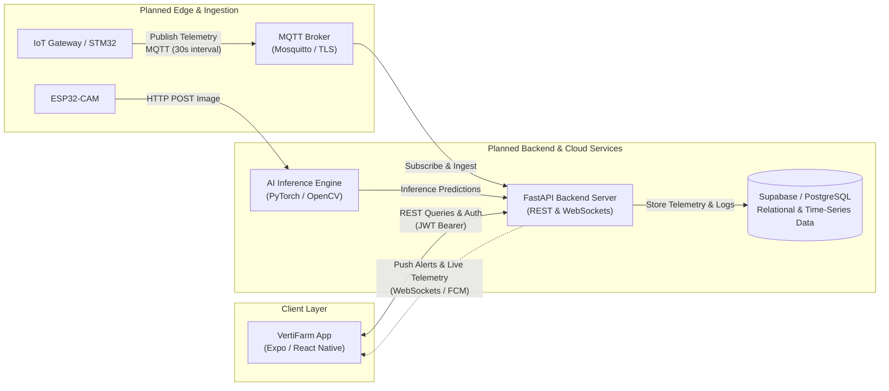
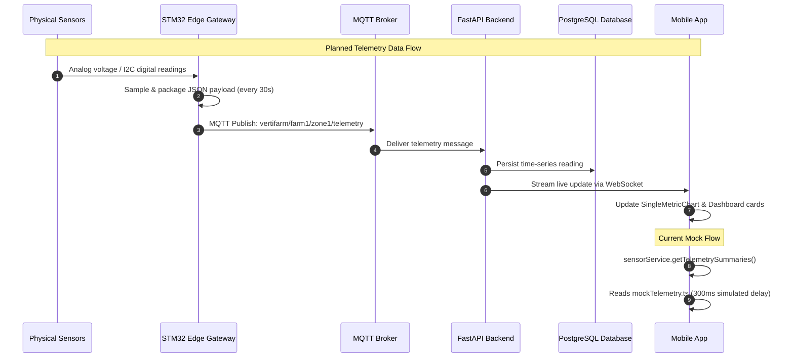
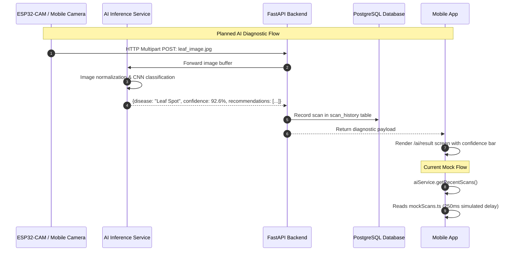
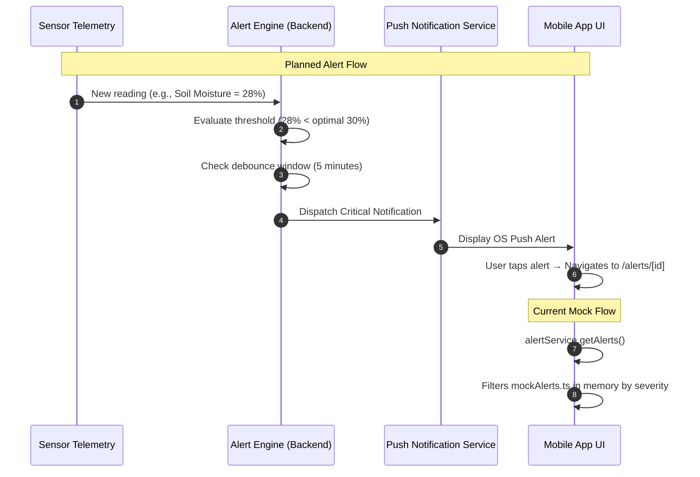

# VertiFarm Architecture

## 1. System Overview

VertiFarm is a mobile-first environmental monitoring and agricultural intelligence application designed for vertical farming operations. The application provides indoor growers, agronomists, and greenhouse managers with real-time insight into climate conditions, soil and nutrient levels, crop health diagnostics, and prioritized operational alerts.

As of today, the project exists as a **client-side mobile application** built on React Native and Expo SDK 57. The application is completely functional from a user-interface and client-workflow perspective, operating in a **mock-first development mode**:

- **Client Execution:** The app runs cross-platform across iOS, Android, and Web environments using React Native 0.86.3, React 19.2.3, and Expo SDK 57.
- **Routing & Navigation:** Declarative, file-based routing is powered by Expo Router v57, structured into authenticated flows, bottom tab navigation, and parameterized detail stack routes.
- **Service Abstraction:** UI components never query data directly; all data access is mediated through a dedicated service layer (`services/`).
- **Data Source:** Services currently consume structured mock datasets (`data/mock/`) with simulated asynchronous network delays to replicate real API latency.
- **Authentication:** Google OAuth 2.0 authentication is implemented on the client via `expo-auth-session`, paired with local session persistence and an email/password authentication fallback for offline development.
- **Design System:** A cohesive botanical design system is codified through centralized design tokens (`constants/`) and reusable UI primitives (`components/ui/` and `components/charts/`).
- **Backend & Database Foundation (Stage 4):** A dedicated Python FastAPI backend (`backend/app/`) with PostgreSQL / Supabase schema (`backend/app/db/schema.sql`), Pydantic models, user ownership isolation, and mobile API adapter (`services/apiClient.ts`).
- **IoT & Realtime Telemetry (Stage 5):** Unified telemetry ingestion pipeline: Sensors / ESP32 → MQTT Broker → FastAPI MQTT Ingestion (`backend/app/services/mqtt_service.py`) → PostgreSQL / Supabase time-series persistence (`sensor_readings`) → REST + Realtime WebSockets (`backend/app/services/realtime_service.py`) → VertiFarm Mobile App (`services/sensorService.ts`).

The architecture is explicitly constructed to establish clean boundaries between the presentation layer, the domain models, and data access. Services interface with the FastAPI backend when `EXPO_PUBLIC_API_URL` is configured, while retaining offline mock data fallback for development.


---

## 2. Architecture Diagram

The diagram below illustrates the current architecture of the VertiFarm system as it exists today, while clearly delineating the planned backend, edge, and cloud components.

```mermaid
graph TB
    subgraph ClientApp["CURRENT CLIENT ARCHITECTURE (Implemented)"]
        User(["User / Operator"])

        subgraph Presentation["Presentation Layer"]
            RN["Expo / React Native App (SDK 57 / RN 0.86)"]
            Router["Expo Router (File-Based Navigation)"]

            subgraph Screens["Screen Layer (app/)"]
                AuthScreens["Auth Flow\nsplash / login / signup"]
                TabScreens["Bottom Tabs\nDashboard / Analytics / AI-Scan / Alerts / More"]
                DetailScreens["Detail & Feature Stacks\nlive-data / alerts / sensors / ai / farms / settings"]
            end

            subgraph Components["Reusable Component Library (components/)"]
                UIComponents["UI Primitives\nButton / Card / Badge / CustomText / ScreenContainer"]
                ChartComponents["SVG Visualizations\nSingleMetricChart / MultiMetricChart"]
            end
        end

        subgraph LogicLayer["Domain & Service Layer"]
            Services["Service Abstraction Layer (services/)\nauthService / sensorService / alertService / farmService / aiService"]
            DomainModels["TypeScript Domain Models (types/index.ts)\nFarm / Zone / SensorDevice / TelemetrySummary / AlertItem / AIScan"]
            DesignTokens["Design Tokens (constants/)\ncolors / typography / spacing / radii / config"]
        end

        subgraph LocalData["Current Mock Data Layer (data/mock/)"]
            MockTelemetry["mockTelemetry.ts (24h time-series)"]
            MockSensors["mockSensors.ts (6 hardware devices)"]
            MockAlerts["mockAlerts.ts (severity-tiered)"]
            MockScans["mockScans.ts (disease predictions)"]
            MockFarms["mockFarms.ts & mockRecommendations.ts"]
            ClientSession["Local Storage / Memory Session\n(@vertifarm_user_session)"]
        end
    end

    subgraph PlannedBackend["PLANNED SYSTEM BOUNDARIES (Not Yet Implemented)"]
        subgraph CloudAPI["Planned Cloud Services"]
            FastAPI["FastAPI REST Server (Stage 4)"]
            SupabaseDB[("PostgreSQL / Supabase (Stage 4)")]
            AIInference["AI Inference Service (PyTorch / TF)"]
        end

        subgraph IoTGateway["Planned Edge & IoT Ingestion"]
            MQTTBroker["MQTT Broker (Mosquitto)"]
            STM32["STM32 IoT Gateway Microcontroller"]
            SensorsHardware["Hardware Sensors (DHT22, Soil, pH, TDS, BH1750)"]
            ESPCam["ESP32-CAM (Plant Imagery)"]
        end
    end

    %% Current Active Flows
    User --> RN
    RN --> Router
    Router --> Screens
    Screens --> UIComponents
    Screens --> ChartComponents
    Screens --> Services
    Services -.-> DomainModels
    Screens -.-> DesignTokens
    UIComponents -.-> DesignTokens
    ChartComponents -.-> DesignTokens
    Services --> MockTelemetry
    Services --> MockSensors
    Services --> MockAlerts
    Services --> MockScans
    Services --> MockFarms
    Services --> ClientSession

    %% Planned Integration Flows (Dotted)
    Services -.->|"Future REST / WS (EXPO_PUBLIC_API_URL)"| FastAPI
    SensorsHardware -.->|"Analog / Digital / I2C"| STM32
    STM32 -.->|"Wi-Fi / MQTT Pub"| MQTTBroker
    MQTTBroker -.->|"Ingest & Telemetry Workers"| FastAPI
    ESPCam -.->|"Image Stream / HTTP Post"| AIInference
    AIInference -.->|"Disease Diagnoses"| FastAPI
    FastAPI -.->|"Persistence"| SupabaseDB

    %% Styling
    style ClientApp fill:#F8F9F6,stroke:#1B3B2B,stroke-width:2px
    style PlannedBackend fill:#F3F4F6,stroke:#9CA3AF,stroke-width:2px,stroke-dasharray: 5 5
    style RN fill:#1B3B2B,stroke:#34A853,stroke-width:2px,color:#fff
    style Router fill:#2D5A43,stroke:#1B3B2B,stroke-width:1px,color:#fff
    style Services fill:#34A853,stroke:#1B3B2B,stroke-width:2px,color:#fff
    style DomainModels fill:#E8F5E9,stroke:#2E7D32,stroke-width:1px,color:#1B5E20
    style FastAPI fill:#E5E7EB,stroke:#9CA3AF,stroke-dasharray: 4 4,color:#374151
    style SupabaseDB fill:#E5E7EB,stroke:#9CA3AF,stroke-dasharray: 4 4,color:#374151
    style MQTTBroker fill:#E5E7EB,stroke:#9CA3AF,stroke-dasharray: 4 4,color:#374151
    style STM32 fill:#E5E7EB,stroke:#9CA3AF,stroke-dasharray: 4 4,color:#374151
```



---

## 3. Frontend Architecture

### 3.1 Expo & React Native Framework
- **Expo SDK Version:** Expo SDK 57 (`~57.0.20`), configured through [app.json](file:///d:/farm-app/app.json).
- **React Native Version:** React Native `0.86.3` with React `19.2.3` and React DOM `19.2.3`.
- **Target Platforms:** iOS, Android, and Web (`react-native-web` `^0.21.2`).
- **Configuration & Plugins:**
  - Application name: `VertiFarm`, slug: `vertifarm`.
  - Custom URL scheme: `vertifarm://` registered for deep linking and OAuth callback handling.
  - Bundle identifier (iOS): `com.vertifarm.app`.
  - Package name (Android): `com.vertifarm.app`.
  - Configured Expo plugins: `expo-router` and `expo-web-browser`.
  - Splash configuration: Contain resize mode with `#1B3B2B` brand background color.

### 3.2 TypeScript Configuration
- **TypeScript Version:** `~6.0.3` running with `@types/react` `~19.2.2`.
- **Strict Typing:** All components, service interfaces, hooks, and navigation parameters are strictly typed.
- **Domain Models:** Centralized in [types/index.ts](file:///d:/farm-app/types/index.ts). No loose `any` types are utilized in component props or domain interfaces.
- **Type Checking:** Validated via `npx tsc --noEmit` with zero compiler errors.

### 3.3 Expo Router (File-Based Navigation)
The application entry point is configured in [package.json](file:///d:/farm-app/package.json) as `"main": "expo-router/entry"`. Expo Router utilizes file-system conventions to automatically build the navigation tree:

- **Root Layout (`app/_layout.tsx`):**
  - Mounts the `SafeAreaProvider` from `react-native-safe-area-context`.
  - Configures the global `StatusBar` to dark text.
  - Implements an asynchronous authentication initialization hook calling `authService.restoreSession()`.
  - Enforces route protection via `useSegments()` and `useRouter()`: unauthenticated users are constrained to `/(auth)` routes, while authenticated sessions are routed directly to `/(tabs)`.
  - Declares the root `Stack` container with card slide transitions (`animation: 'slide_from_right'`).

- **Route Groups:**
  - `(auth)`: Non-tab stack flow for authentication screens (`splash.tsx`, `login.tsx`, `signup.tsx`).
  - `(tabs)`: Bottom tab bar navigation containing the primary application views (`index.tsx`, `analytics.tsx`, `ai-scan.tsx`, `alerts.tsx`, `more.tsx`).

- **Feature Screens & Dynamic Routes:**
  - `live-data/[metric].tsx`: Parameterized metric view displaying live readings, statistical aggregations, and single-metric SVG trend charts.
  - `alerts/[id].tsx`: Parameterized alert detail screen showing threshold deviations and corrective actions.
  - `sensors/index.tsx` and `sensors/add.tsx`: Device inventory and hardware pairing screens.
  - `ai/camera.tsx` and `ai/result.tsx`: Vision capture feed and plant disease diagnostic screens.
  - `farms.tsx`: Multi-facility farm management.
  - `recommendations.tsx`: Agronomic guidance categorized by tab ('forYou' vs 'general').
  - `history.tsx`: Historical timeline of alerts, scans, and telemetry logs.
  - `settings.tsx`: Profile inspection, farm switcher, sensor configuration, and sign-out.

### 3.4 Reusable Component Library
The UI is broken down into modular components within the `components/` directory:

- **Primitives (`components/ui/`):**
  - [Button.tsx](file:///d:/farm-app/components/ui/Button.tsx): Customizable interactive button supporting `primary`, `secondary`, `outline`, and `ghost` variants, three size scales, loading indicators, and disabled states.
  - [Card.tsx](file:///d:/farm-app/components/ui/Card.tsx): Surface container supporting `default`, `elevated`, `subtle`, `outline`, and `hero` styling variants.
  - [Badge.tsx](file:///d:/farm-app/components/ui/Badge.tsx): Status indicators mapped to system health levels with `solid`, `subtle`, and `outline` visual modes.
  - [CustomText.tsx](file:///d:/farm-app/components/ui/CustomText.tsx): Typography primitive ensuring uniform font application.
  - [ScreenContainer.tsx](file:///d:/farm-app/components/ui/ScreenContainer.tsx): Standardized wrapper applying safe-area insets, background colors, and optional scrolling.

- **Visualizations (`components/charts/`):**
  - [SingleMetricChart.tsx](file:///d:/farm-app/components/charts/SingleMetricChart.tsx): Custom SVG area and line chart built with `react-native-svg`. Includes cubic smoothing, horizontal dashed grid lines, Y-axis bounds, dynamic X-axis timestamp distribution, gradient fills, and data point circular markers.
  - [MultiMetricChart.tsx](file:///d:/farm-app/components/charts/MultiMetricChart.tsx): Multi-series SVG line chart supporting simultaneous rendering of multiple normalized environmental metrics with interactive color-coded legends.

---

## 4. Project Structure

The codebase is organized into clean functional modules:

```
farm-app/
├── .env.example                  # Template for OAuth credentials and API base URL
├── .gitignore                    # Git exclusions (node_modules, .expo, .env)
├── app.json                      # Expo application manifest, scheme, and plugins
├── package.json                  # Dependencies, scripts, and Expo router entry
├── tsconfig.json                 # TypeScript compiler configuration
├── AGENTS.md                     # Project governance and Expo SDK rules
├── README.md                     # Project introduction and quickstart guide
├── PHASE1_REPORT.md              # Historical milestone validation record
├── ARCHITECTURE.md               # Current system architecture documentation (this document)
│
├── app/                          # Expo Router navigation tree
│   ├── _layout.tsx               # Root navigation stack and session route guards
│   ├── index.tsx                 # Entry redirect controller (Auth verification)
│   ├── (auth)/                   # Authentication route group
│   │   ├── _layout.tsx           # Stack layout for auth screens
│   │   ├── splash.tsx            # Brand splash screen with onboarding call-to-action
│   │   ├── login.tsx             # Login screen with Google OAuth and email fallback
│   │   └── signup.tsx            # Account registration screen
│   ├── (tabs)/                   # 5-Tab bottom navigation group
│   │   ├── _layout.tsx           # Tab bar layout, iconography, and active styling
│   │   ├── index.tsx             # Dashboard: Hero banner, sensor grid, health summary
│   │   ├── analytics.tsx         # Multi-metric historical trend analysis & SVG charts
│   │   ├── ai-scan.tsx           # AI plant health diagnostics and recent scan list
│   │   ├── alerts.tsx            # Severity-filtered notification and alert center
│   │   └── more.tsx              # Menu routing to secondary feature modules
│   ├── live-data/
│   │   └── [metric].tsx          # Dynamic route for specific metric telemetry
│   ├── alerts/
│   │   └── [id].tsx              # Dynamic route for alert detail and resolution
│   ├── sensors/
│   │   ├── index.tsx             # Hardware device inventory and status listing
│   │   └── add.tsx               # Sensor provisioning and pairing form
│   ├── ai/
│   │   ├── camera.tsx            # Optical camera stream viewfinder simulation
│   │   └── result.tsx            # Disease diagnostic result with recommendations
│   ├── farms.tsx                 # Greenhouse and facility management
│   ├── recommendations.tsx       # Curated agronomic suggestions and advice
│   ├── history.tsx               # Unified timeline of farm logs and alerts
│   ├── settings.tsx              # User preferences, device settings, and logout
│   ├── auth/                     # Scaffolded legacy directory (empty)
│   └── tabs/                     # Scaffolded legacy directory (empty)
│
├── components/                   # Component architecture
│   ├── ui/                       # Design system core primitives
│   │   ├── Badge.tsx             # Health and severity status pills
│   │   ├── Button.tsx            # Standardized button variants
│   │   ├── Card.tsx              # Surface containers
│   │   ├── CustomText.tsx        # Typography wrapper
│   │   └── ScreenContainer.tsx   # Screen layout and safe-area wrapper
│   ├── charts/                   # Charting components
│   │   ├── SingleMetricChart.tsx # SVG single-series trend line chart
│   │   └── MultiMetricChart.tsx  # SVG multi-series comparison chart
│   ├── cards/                    # Scaffolded directory for specialized domain cards
│   ├── sensors/                  # Scaffolded directory for sensor widgets
│   ├── alerts/                   # Scaffolded directory for alert cards
│   ├── ai/                       # Scaffolded directory for scan components
│   └── navigation/               # Scaffolded directory for custom navigation items
│
├── constants/                    # Design tokens & configuration constants
│   ├── colors.ts                 # Brand colors, status palette, metric accents
│   ├── typography.ts             # Font sizes, weights, line heights, letter spacing
│   ├── spacing.ts                # Dimensional spacing scale and semantic aliases
│   ├── radii.ts                  # Border radius scale and semantic aliases
│   └── config.ts                 # App runtime constants, intervals, and env bindings
│
├── data/                         # Data layer
│   └── mock/                     # Seed datasets representing vertical farm state
│       ├── mockAlerts.ts         # Sample critical, warning, and info alerts
│       ├── mockFarms.ts          # Sample greenhouse facilities
│       ├── mockRecommendations.ts# Agronomic care recommendations
│       ├── mockScans.ts          # Computer vision leaf disease scans
│       ├── mockSensors.ts        # Configured hardware sensor devices
│       └── mockTelemetry.ts      # 24-hour time-series datasets for all 6 metrics
│
├── services/                     # Service abstraction layer
│   ├── authService.ts            # Google OAuth flow, JWT decoding, session storage
│   ├── sensorService.ts          # Telemetry queries and farm health status
│   ├── alertService.ts           # Alert querying, filtering, and resolution
│   ├── farmService.ts            # Farm facility queries
│   └── aiService.ts              # Plant scans, camera trigger, and recommendations
│
├── types/                        # Domain models and TypeScript contracts
│   └── index.ts                  # Entity interfaces (Farm, Sensor, Reading, Alert, etc.)
│
├── utils/                        # General helper utilities (scaffolded directory)
├── hooks/                        # Custom React hooks (scaffolded directory)
├── docs/                         # Documentation directory (scaffolded directory)
└── assets/                       # Static graphical assets (icon, splash, images)
```

---

## 5. Design System

The visual identity of VertiFarm follows a curated **Botanical SaaS** aesthetic matching agricultural technology workflows. Design tokens are strictly defined in `constants/` to ensure visual consistency across screens.

### 5.1 Color System (`constants/colors.ts`)
- **Brand Palette:**
  - Primary Forest Green: `#1B3B2B` (used for main headers, active tab highlights, and primary actions).
  - Primary Light: `#2D5A43`.
  - Primary Muted: `#E8F3ED` (used for icon circular backgrounds and pill containers).
  - Leaf Green Accent: `#34A853` (vibrant brand accent for positive status and botanical icons).
- **Backgrounds & Surfaces:**
  - App Background: Soft warm cream `#F8F9F6`.
  - Secondary Background: `#F1F3EE`.
  - Surface Containers: Pure White `#FFFFFF` and Subtle Surface `#F9FAF7`.
- **Content & Typography:**
  - Primary Text: Deep Charcoal `#1A2E22`.
  - Secondary Text: Slate Green `#5C6B62`.
  - Muted Text: `#8E9E94` (placeholders and captions).
  - Inverse Text: `#FFFFFF`.
- **Status Classification System:**
  Status colors are designed with explicit background, border, primary, and text tokens so that status is never conveyed by color alone:
  - `healthy`: Green `#2E7D32` (Label: "Normal")
  - `warning`: Amber `#D97706` (Label: "Warning")
  - `critical`: Red `#DC2626` (Label: "Attention")
  - `offline`: Slate `#6B7280` (Label: "Offline")
  - `info`: Blue `#0284C7` (Label: "Info")
- **Metric Accent Palette:**
  Specific accents correlate directly with environmental telemetry domains:
  - Temperature: Red `#E53E3E`
  - Humidity: Blue `#3182CE`
  - Soil Moisture: Green `#38A169`
  - pH: Purple `#805AD5`
  - TDS: Teal `#0D9488`
  - Light: Amber `#D97706`

### 5.2 Typography System (`constants/typography.ts`)
- Utilizes the platform's native Sans-Serif font system (`System`).
- Strict size scale:
  - `largeMetric`: 32px (for telemetry headline values, e.g., "32.6°C")
  - `screenTitle`: 26px (screen top headers)
  - `sectionTitle`: 20px (major section headings)
  - `navTitle`: 17px (top navigation bar titles)
  - `cardTitle`: 16px (card header titles)
  - `bodyLarge`: 15px, `button`: 15px, `input`: 15px
  - `body`: 14px (standard interface copy)
  - `label`: 13px (input field labels)
  - `caption`: 12px (timestamps and metadata)
  - `small`: 11px, `tab`: 11px (tab bar labels and badge text)
- Weight tokens: `regular` (400), `medium` (500), `semibold` (600), `bold` (700).

### 5.3 Spacing & Radii (`constants/spacing.ts`, `constants/radii.ts`)
- **Spacing Scale:** Built on a 4px/8px incremental scale: `xs` (4), `sm` (8), `md` (12), `lg` (16), `xl` (20), `xxl` (24), `xxxl` (32), `huge` (40), `massive` (48).
  - Semantic spacing: `cardPadding: 16`, `cardGap: 12`, `screenPadding: 20`, `sectionGap: 24`, `buttonPadding: 16`.
- **Border Radii:** Modern curved card aesthetic: `xs` (6), `sm` (10), `md` (12), `lg` (16), `xl` (18), `xxl` (20), `huge` (24), `pill` (999).
  - Semantic radii: `button: 12`, `input: 12`, `card: 18`, `cardLarge: 20`, `badge: 999`, `chip: 999`, `modal: 20`.

### 5.4 Configuration Tokens (`constants/config.ts`)
- App metadata: `VertiFarm`, version `1.0.0`.
- API endpoints: Base URL mapped from `process.env.EXPO_PUBLIC_API_URL` with a 30,000ms default timeout.
- Client IDs: Mappings for Google OAuth across platforms.
- Operational parameters: Sensor poll interval (`5000ms`), sensor offline cutoff (`60000ms`), camera auto-capture interval (`30m`), alert debouncing threshold (`300000ms`).

---

## 6. Data Architecture

### 6.1 TypeScript Domain Models (`types/index.ts`)
The application defines formal interfaces for all domain entities matching vertical farming structures:

- **`Farm`**: Represents an agricultural production facility (`id`, `name`, `location`, `sensorCount`, `zoneCount`, `isActive`, `imageUrl`, `createdAt`).
- **`Zone`**: Represents a distinct environmental cultivation zone within a farm (`id`, `farmId`, `name`, `crop`, `sensorCount`).
- **`SensorDevice`**: Represents an edge sensing or imaging device (`id`, `name`, `type`, `metric`, `zoneId`, `zoneName`, `status`, `lastSeen`, `batteryLevel`).
- **`SensorReading`**: Individual instantaneous telemetry sample (`id`, `sensorId`, `metric`, `value`, `unit`, `status`, `statusLabel`, `timestamp`).
- **`TelemetrySummary`**: Aggregated metric structure driving dashboards and detail views (`metric`, `name`, `currentValue`, `unit`, `status`, `statusLabel`, `min`, `max`, `avg`, `optimalMin`, `optimalMax`, `optimalText`, `trend`, `timestamps`).
- **`AlertItem`**: Dispatched operational notification (`id`, `farmId`, `zoneId`, `zoneName`, `metric`, `severity`, `title`, `description`, `currentValue`, `thresholdValue`, `timestamp`, `isResolved`, `recommendation`).
- **`AIScan`**: Plant health inference record (`id`, `plantType`, `diseaseName`, `isHealthy`, `confidence`, `imageUrl`, `timestamp`, `recommendations`).
- **`CameraCapture`**: Edge vision device feed metadata (`id`, `cameraId`, `zoneName`, `imageUrl`, `timestamp`, `isLive`, `nextCaptureIn`).
- **`RecommendationItem`**: Agronomic optimization tip (`id`, `category`, `title`, `description`, `priority`, `tab`, `actionableLink`).
- **`UserProfile` & `AuthUser`**: Session and user account representations (`id`, `name`, `role`, `farmName`, `email`, `avatarUrl`, `authProvider`, `googleId`, `accessToken`, `idToken`, `createdAt`).
- **Type Enums**: `StatusLevel` ('healthy' | 'warning' | 'critical' | 'offline' | 'info') and `MetricType` ('temperature' | 'humidity' | 'soilMoisture' | 'ph' | 'tds' | 'light').

### 6.2 Mock Data Infrastructure (`data/mock/`)
The current system runs entirely against realistic mock datasets that reflect agronomic baselines:

| Metric | Current Reading | Optimal Range | Status in Mock Data |
|---|---|---|---|
| Temperature | 32.6 °C | 20.0 – 30.0 °C | Normal / Borderline Warning |
| Humidity | 65.4 % | 60.0 – 80.0 % | Normal |
| Soil Moisture | 48.0 % | 40.0 – 60.0 % | Normal |
| Soil pH | 6.58 pH | 6.00 – 7.00 pH | Slightly Acidic (Normal) |
| TDS | 620 ppm | 500 – 800 ppm | Normal |
| Light Intensity | 1200 lux | 1000 – 1500 lux | Normal |

- **Time-Series Generator:** `mockTelemetry.ts` includes `generateTimeSeries(baseValue, variance, points)` to synthesize 24-hour historical points with realistic mathematical fluctuations.
- **Hardware Registry:** `mockSensors.ts` registers 6 hardware devices (DHT22, Capacitive, Analog pH, Analog TDS, BH1750, ESP32-CAM) reporting from Zone 1.
- **Alert Seed:** `mockAlerts.ts` provides 5 sample alerts testing critical (low soil moisture), warning (elevated temperature, high pH), and informational states.
- **AI Scan Seed:** `mockScans.ts` supplies diagnoses for Tomato Leaf Spot (92.6% confidence), Lettuce Powdery Mildew (87.3% confidence), and a Healthy Lettuce crop (98.1% confidence).

---

## 7. Service Layer

The application enforces a service abstraction pattern. All UI screens interact with asynchronous service methods rather than directly reading raw data files or invoking networking primitives.

### 7.1 `sensorService` ([services/sensorService.ts](file:///d:/farm-app/services/sensorService.ts))
- `getTelemetrySummaries()`: Simulates network latency (300ms) and returns the full array of `TelemetrySummary` objects.
- `getTelemetryByMetric(metric)`: Retrieves telemetry details for a specific environmental metric with 200ms delay.
- `getSensorDevices()`: Retrieves the list of all registered physical sensor hardware units.
- `getFarmHealthStatus()`: Evaluates the status of all current telemetry metrics to derive the holistic farm health classification (`healthy`, `warning`, or `critical`) and display message.

### 7.2 `alertService` ([services/alertService.ts](file:///d:/farm-app/services/alertService.ts))
- `getAlerts()`: Fetches all active alerts (250ms simulated latency).
- `getAlertsBySeverity(severity)`: Filters alerts by 'all', 'critical', 'warning', or 'info'.
- `getAlertById(id)`: Fetches full diagnostic details for a specific alert identifier.
- `resolveAlert(id)`: Simulates sending an alert acknowledgement and resolution request to a server (300ms latency), logging the operation to the console and returning a boolean confirmation.

### 7.3 `farmService` ([services/farmService.ts](file:///d:/farm-app/services/farmService.ts))
- `getFarms()`: Returns the list of registered greenhouses and vertical farm facilities.
- `getFarmById(id)`: Finds a farm record by identifier.
- `getCurrentFarm()`: Returns the currently selected farm (defaults to Greenhouse 1).

### 7.4 `aiService` ([services/aiService.ts](file:///d:/farm-app/services/aiService.ts))
- `getRecentScans()`: Returns the historical log of computer vision disease analyses.
- `getScanById(id)`: Fetches a single scan record with specific pathogen recommendations.
- `getCameraStatus()`: Retrieves the current ESP32-CAM stream metadata and countdown status.
- `captureImage()`: Simulates triggering an on-demand hardware optical capture (1000ms delay).
- `getRecommendations(tab)`: Retrieves agronomic recommendations filtered by category tab ('forYou' or 'general').

### 7.5 `authService` ([services/authService.ts](file:///d:/farm-app/services/authService.ts))
Handles Google OAuth token parsing, user identity fetching, mock email authentication, and local session management (detailed in Section 8).

---

## 8. Authentication

The authentication architecture combines client-side Google OAuth 2.0 with a mock authentication pipeline for local development and testing.

### 8.1 OAuth Flow Implementation
1. **Redirect Completion:** `WebBrowser.maybeCompleteAuthSession()` is invoked at the module level in [app/(auth)/login.tsx](file:///d:/farm-app/app/(auth)/login.tsx) to ensure browser redirects correctly hand control back to the Expo runtime.
2. **Android Browser Warming:** When running on Android, `WebBrowser.warmUpAsync()` and `WebBrowser.coolDownAsync()` are invoked to pre-warm the Android Custom Tabs engine for seamless modal presentation.
3. **Auth Request Creation:** Configured via `Google.useAuthRequest` from `expo-auth-session/providers/google`. Configured with:
   - Scopes: `['openid', 'profile', 'email']`
   - Prompt: `selectAccount: true`
   - Platform-specific Client IDs fetched via `authService.getGoogleClientIds()`.
4. **Credential Validation:** If credentials are not configured in `.env`, the UI gracefully alerts the developer without crashing.
5. **Response Processing:** When the OAuth response returns:
   - On `success`, tokens (`accessToken` or `idToken`) are forwarded to `authService.handleGoogleAuthResponse(response)`.
   - On `cancel` or `dismiss`, loading states are reset without displaying errors.
   - On `error`, actionable error messages are displayed within the UI.
6. **User Identity Resolution:**
   - Primary: Uses the Google OAuth `accessToken` to query the Google UserInfo v2 endpoint (`https://www.googleapis.com/userinfo/v2/me`).
   - Fallback: Queries the OpenID Connect endpoint (`https://openidconnect.googleapis.com/v1/userinfo`).
   - Token Decoding: If the network query fails, an embedded pure-JavaScript base64 and JWT decoder (`decodeJwtPayload`) extracts the `sub`, `email`, `name`, and `picture` claims directly from the `idToken`.
7. **Session Creation:** Constructs an `AuthUser` object with role, default farm, and provider metadata, then persists the session.

### 8.2 Environment Variables
Environment variables are defined in [.env.example](file:///d:/farm-app/.env.example) and accessed via `process.env`:
- `EXPO_PUBLIC_GOOGLE_WEB_CLIENT_ID`: Google OAuth client ID for Web development (`http://localhost:8081`).
- `EXPO_PUBLIC_GOOGLE_IOS_CLIENT_ID`: Client ID for iOS standalone builds (bundle ID `com.vertifarm.app`).
- `EXPO_PUBLIC_GOOGLE_ANDROID_CLIENT_ID`: Client ID for Android standalone builds (package `com.vertifarm.app`).
- `EXPO_PUBLIC_GOOGLE_CLIENT_ID`: Fallback client ID if platform-specific credentials are omitted.
- `EXPO_PUBLIC_API_URL`: Reserved for backend REST endpoints (Stage 4).

### 8.3 Session Handling
- **Storage Adapter:** An internal universal storage abstraction in `authService.ts` safely interfaces with `window.localStorage` when running in a browser.
- **In-Memory Fallback:** When running natively on iOS or Android, sessions are currently maintained in memory (`let currentUserSession: AuthUser | null`).
- **Route Protection:** `app/_layout.tsx` validates session presence on mount and subscribes to route segment updates, routing unauthenticated users to `/login` and authenticated users to `/(tabs)`.

### 8.4 Current Limitations vs Backend Requirements
- **No Token Signature Verification:** Google ID tokens are decoded on the client. A future backend must accept the token and verify Google's signature via Google API public keys.
- **No Native Persistent Storage:** Because `@react-native-async-storage/async-storage` or `expo-secure-store` is not yet installed, native app cold restarts clear the active session.
- **Mock Fallback:** Email/password login and sign-up generate deterministic mock user sessions without password hashing or database validation.

---

## 9. Navigation Architecture

Navigation in VertiFarm is structured via Expo Router v57. The route hierarchy is organized into distinct navigational domains:

```mermaid
graph TD
    Root["Root Stack Navigator (app/_layout.tsx)"]

    Index["/ (app/index.tsx)\nAuth Check & Redirect"]
    AuthGroup["(auth) Route Group\nFade Animation"]
    TabGroup["(tabs) Route Group\nBottom Tab Bar"]
    StackRoutes["Direct Stack Screens\nCard Presentation"]

    Root --> Index
    Root --> AuthGroup
    Root --> TabGroup
    Root --> StackRoutes

    AuthGroup --> Splash["/(auth)/splash\nBrand Welcome"]
    AuthGroup --> Login["/(auth)/login\nOAuth & Email Sign-in"]
    AuthGroup --> Signup["/(auth)/signup\nAccount Creation"]

    TabGroup --> TabHome["/(tabs)/ (Home Dashboard)"]
    TabGroup --> TabAnalytics["/(tabs)/analytics (Trends)"]
    TabGroup --> TabAIScan["/(tabs)/ai-scan (Health)"]
    TabGroup --> TabAlerts["/(tabs)/alerts (Alert List)"]
    TabGroup --> TabMore["/(tabs)/more (Feature Menu)"]

    StackRoutes --> LiveData["/live-data/[metric]\nDetailed Metric & Chart"]
    StackRoutes --> AlertDetails["/alerts/[id]\nAlert Diagnostic View"]
    StackRoutes --> SensorsIndex["/sensors\nHardware Inventory"]
    StackRoutes --> SensorsAdd["/sensors/add\nDevice Pairing"]
    StackRoutes --> AICamera["/ai/camera\nViewfinder Stream"]
    StackRoutes --> AIResult["/ai/result\nDiagnostic Results"]
    StackRoutes --> Farms["/farms\nFarm Management"]
    StackRoutes --> Recommendations["/recommendations\nAgronomic Tips"]
    StackRoutes --> History["/history\nAudit Log Timeline"]
    StackRoutes --> Settings["/settings\nProfile & Configuration"]
```



### Route Inventory

| Route Path | Navigation Type | Responsibility |
|---|---|---|
| `app/index.tsx` | Entry Redirect | Asynchronously checks auth session; routes to `/(tabs)` or `/(auth)/splash`. |
| `app/(auth)/splash.tsx` | Stack Screen | Initial splash presentation with brand motto and entry CTA. |
| `app/(auth)/login.tsx` | Stack Screen | Primary login screen supporting Google OAuth and email/password. |
| `app/(auth)/signup.tsx` | Stack Screen | New user registration form. |
| `app/(tabs)/index.tsx` | Bottom Tab (Home) | Dashboard featuring live metric grid, status banner, and greeting. |
| `app/(tabs)/analytics.tsx`| Bottom Tab (Analytics)| Multi-metric historical comparisons with time-filter controls. |
| `app/(tabs)/ai-scan.tsx` | Bottom Tab (AI Scan) | Overview of plant health status and recent optical disease scans. |
| `app/(tabs)/alerts.tsx` | Bottom Tab (Alerts) | Severity-filtered alert center (All, Critical, Warning, Info). |
| `app/(tabs)/more.tsx` | Bottom Tab (More) | Navigation portal linking to sensors, farms, recommendations, and settings. |
| `app/live-data/[metric].tsx`| Push Stack Screen | High-resolution metric telemetrics, statistics (min/max/avg), and SVG chart. |
| `app/alerts/[id].tsx` | Push Stack Screen | Detailed alert breakdown with threshold comparison and resolution button. |
| `app/sensors/index.tsx` | Push Stack Screen | Device health inventory displaying battery, online state, and last seen. |
| `app/sensors/add.tsx` | Push Stack Screen | Form to pair and configure new hardware sensing nodes. |
| `app/ai/camera.tsx` | Push Stack Screen | Live camera stream simulation with automatic capture countdown. |
| `app/ai/result.tsx` | Push Stack Screen | Disease classification results, confidence score, and treatment actions. |
| `app/farms.tsx` | Push Stack Screen | Multi-greenhouse overview, location metadata, and zone counts. |
| `app/recommendations.tsx` | Push Stack Screen | Agronomic advisory engine split into 'For You' and 'General' feeds. |
| `app/history.tsx` | Push Stack Screen | Daily event log and historical audit trail for sensor warnings. |
| `app/settings.tsx` | Push Stack Screen | Operator profile, greenhouse settings, dark mode toggle, and logout. |

---

## 10. Current vs Planned Architecture

The table below contrasts the current, fully verified state of the codebase against the planned future architecture:

| Layer | Current (Implemented Today) | Planned (Future Architecture) |
|---|---|---|
| **Mobile UI** | React Native 0.86, Expo SDK 57, Expo Router v57, TypeScript 6.0, custom SVG charting (`react-native-svg`), botanical design tokens. | Production mobile app on Google Play Store & Apple App Store; offline synchronization, native secure storage, haptic feedback. |
| **Authentication** | Client-side Google OAuth 2.0 (`expo-auth-session`), local session storage, FastAPI token verification & offline dev authentication. | Backend session cookies and refresh token rotators; Supabase Auth production synchronization. |
| **API** | FastAPI RESTful API (`backend/app/`) with automated OpenAPI docs, auth guards, telemetry endpoints, and WebSockets. | Multi-instance load balancing, external API rate limiting, and automated health telemetry. |
| **Database** | PostgreSQL / Supabase schema (`schema.sql`) with user isolation, RLS policies, and in-memory transactional database (`db/session.py`). | Live Supabase PostgreSQL managed cluster with automated migration pipelines. |
| **IoT & Ingestion** | Full ingestion pipeline: `vertifarm/{farm_id}/{sensor_id}/telemetry`, validation of 6 metrics, physical bounds checks, deduplication, and DB persistence. | STM32 / ESP32 physical edge hardware deployment with local calibration and fail-safes. |
| **MQTT** | Paho-MQTT v2 client service (`mqtt_service.py`) supporting single and batch payloads, configurable broker, and background loop. | Managed Eclipse Mosquitto or cloud EMQX broker cluster with mTLS client certificates. |
| **Realtime** | WebSocket streaming (`/api/v1/telemetry/ws`), async event queues (`realtime_service.py`), and mobile client WebSocket adapter. | Supabase Realtime CDC replication and automated edge mesh notifications. |
| **AI** | Pre-generated diagnostic entries in `mockScans.ts` and FastAPI AI scan models. | Server-side Python inference pipeline (FastAPI + PyTorch/ONNX/TensorFlow); OpenCV leaf segmentation. |
| **Notifications** | Client-side UI badges, alert center, and backend alert resolution APIs. | Push notifications via Expo Push Notification Service (FCM/APNs) triggered by dynamic threshold breach engine. |


---

## 11. Future Backend Architecture

When backend development commences, the system will expand into a distributed IoT and cloud intelligence pipeline. The mobile client will transition from reading local mock data to consuming secured REST and streaming endpoints.



### Intended Component Responsibilities

1. **Mobile Application (Client Layer):**
   - Connects to FastAPI via HTTPS using Axios or Fetch.
   - Attaches Bearer JWT tokens to all requests.
   - Subscribes to WebSocket channels or Supabase Realtime for instant telemetry and alert delivery.
   - Renders responsive charts and UI states using the existing component and service abstraction.

2. **FastAPI Backend Server:**
   - **Authentication:** Validates Google ID tokens against Google public keys; issues application session tokens.
   - **Telemetry Ingestion:** Subscribes to MQTT topics; validates incoming payloads; checks thresholds; persists records to database.
   - **Alert Evaluator:** Compares sensor values against user-configured zone bounds (`optimalMin`, `optimalMax`); raises alerts; dispatches push notifications.
   - **REST Endpoints:** Serves CRUD endpoints for farms, zones, sensor configurations, historical aggregations, and recommendations.

3. **Database Layer (PostgreSQL / Supabase):**
   - Stores user profiles, farms, zones, sensor metadata, and alert logs.
   - Leverages time-series optimization (TimescaleDB or partitioned hyper-tables) for high-frequency sensor readings.
   - Manages relational constraints and automated timestamps.

4. **MQTT Broker (Eclipse Mosquitto):**
   - Serves as the lightweight, low-bandwidth bridge between agricultural microcontrollers and the cloud.
   - Secures communication via TLS 1.3 and client authentication certificates.
   - Organizes telemetry under structured hierarchical topics: `vertifarm/{farm_id}/{zone_id}/{sensor_type}/telemetry`.

5. **AI Inference Service:**
   - Dedicated service running Python, OpenCV, and a fine-tuned convolutional neural network (CNN) or Vision Transformer (ViT).
   - Ingests image captures uploaded by ESP32-CAM devices or mobile operators.
   - Analyzes crop foliage for signs of fungal, bacterial, or environmental distress, outputting predicted disease names, confidence percentages, and recommended treatments.

---

## 12. Data Flow

### 12.1 Sensor Telemetry Flow



- **Current Implementation:** The mobile app queries `sensorService.getTelemetrySummaries()` on mount. The service loads `mockTelemetry.ts`, simulates network delay, and returns data directly to component state.
- **Planned Implementation:** Hardware sensors report to the STM32 microcontroller. The STM32 batches readings and publishes to MQTT. The backend ingests the MQTT packet, saves it to PostgreSQL, and broadcasts the updated values over a WebSocket channel to connected mobile clients.

### 12.2 AI Plant Health Diagnostic Flow



- **Current Implementation:** The user taps "Capture Now" on `app/ai/camera.tsx`. The screen triggers `aiService.captureImage()`, waits 1000ms, and pushes navigation to `app/ai/result.tsx`, which loads the first mock entry from `mockScans.ts`.
- **Planned Implementation:** The ESP32-CAM captures high-resolution imagery and posts it to the FastAPI backend. FastAPI routes the image to the AI inference worker. The worker returns classification predictions and treatment steps, which are persisted in the database and displayed to the user.

### 12.3 Operational Alert Flow



- **Current Implementation:** Alerts are loaded from `mockAlerts.ts` via `alertService.getAlerts()`. Users can filter alerts by severity pills and tap "Mark as Resolved", which triggers a console log and simulates a server roundtrip.
- **Planned Implementation:** An asynchronous worker evaluates incoming telemetry against configured min/max thresholds. When an anomaly breaches bounds for a sustained period, an alert record is created, and push notifications are dispatched to operators via Expo Push Notifications (APNs/FCM).

---

## 13. Security Considerations

Although the application is currently running against mock data, architectural patterns have been implemented to ensure security readiness:

1. **OAuth Credentials Isolation:**
   - Client IDs for Google OAuth are externalized into environment variables (`.env.example`).
   - Secret keys are never bundled into mobile client code. Google OAuth for mobile devices utilizes public client flows with PKCE or native redirect schemes, preventing secret exposure.

2. **Environment Variable Rules:**
   - Only variables prefixed with `EXPO_PUBLIC_` are exposed to the client runtime bundle by Metro bundler.
   - Any private keys, database connection strings, or service tokens reserved for the backend must never be given the `EXPO_PUBLIC_` prefix and must never be committed to git.

3. **Client-Side Session Handling:**
   - Web environments utilize browser `localStorage` for session persistence.
   - Before deploying native standalone builds to app stores, native session tokens must be migrated to `expo-secure-store` to ensure credentials are encrypted in the iOS Keychain and Android KeyStore.

4. **Future API Authentication:**
   - When FastAPI is deployed, all communication will run over TLS (HTTPS/WSS).
   - The client will transmit JWT access tokens in the `Authorization: Bearer <token>` header.
   - Expired tokens will be refreshed automatically using HttpOnly secure cookies or refresh token rotation.

5. **Strict Secrets Policy:**
   - `.env` and `.env.local` files are registered in [.gitignore](file:///d:/farm-app/.gitignore) to prevent accidental credential commits.

---

## 14. Scalability Considerations

The architecture is prepared for future scalability without claiming unverified production benchmarks:

- **Service Abstraction Decoupling:** Every screen relies strictly on interfaces exposed by `services/`. When backend APIs become available, developers only update the service implementation (replacing mock returns with `fetch` or `axios` calls); the 17 UI screens remain untouched.
- **Contract-First Domain Types:** TypeScript domain models in `types/index.ts` represent a unified schema. Backend REST DTOs and database schemas can be modeled directly against these interfaces to avoid data mismatch.
- **Client Rendering Optimization:**
  - Dynamic charts in `components/charts/` prune redundant X-axis timestamp labels to prevent visual clutter and maintain high SVG rendering performance.
  - Lists and grids use efficient React Native mapping patterns and lightweight layout wrappers.
- **Simulated Latency Validation:** Artificial delays (150ms to 1000ms) within mock services ensure that UI loading indicators, spinners, and disabled button states are actively exercised and verified during development.

---

## 15. Architecture Principles

Future development on the VertiFarm codebase should adhere to the following architectural principles:

1. **Separation of Concerns:** Keep presentation, business logic, and data storage cleanly decoupled. UI components must never perform direct data fetching or network operations; they must delegate to services.
2. **Reusable UI Primitives:** Never duplicate core styles across screens. Base all buttons, surfaces, text, and badges on the design system components in `components/ui/` and tokens in `constants/`.
3. **Typed Domain Models:** Maintain end-to-end type safety. All payloads, component props, and state variables must conform to formal TypeScript interfaces defined in `types/`. Avoid untyped object literals.
4. **Service Abstraction:** Data providers must remain swappable. Services should export stable async methods returning domain promises so that swapping mock data for live REST or WebSocket feeds is transparent to the UI.
5. **Mock-First Development:** Ensure new features can be scaffolded, prototyped, and visually verified against realistic local data contracts before blocking on backend or IoT hardware readiness.
6. **Backend-Ready Architecture:** Design client models, operational statuses, and error handling patterns to anticipate real-world cloud APIs, network disconnects, and async synchronization.
7. **Minimal Unnecessary Complexity:** Avoid adding external state management libraries (such as Redux or MobX) or heavy dependencies until application complexity explicitly demands them. Leverage React's built-in hooks, Expo Router parameters, and focused service singletons.
