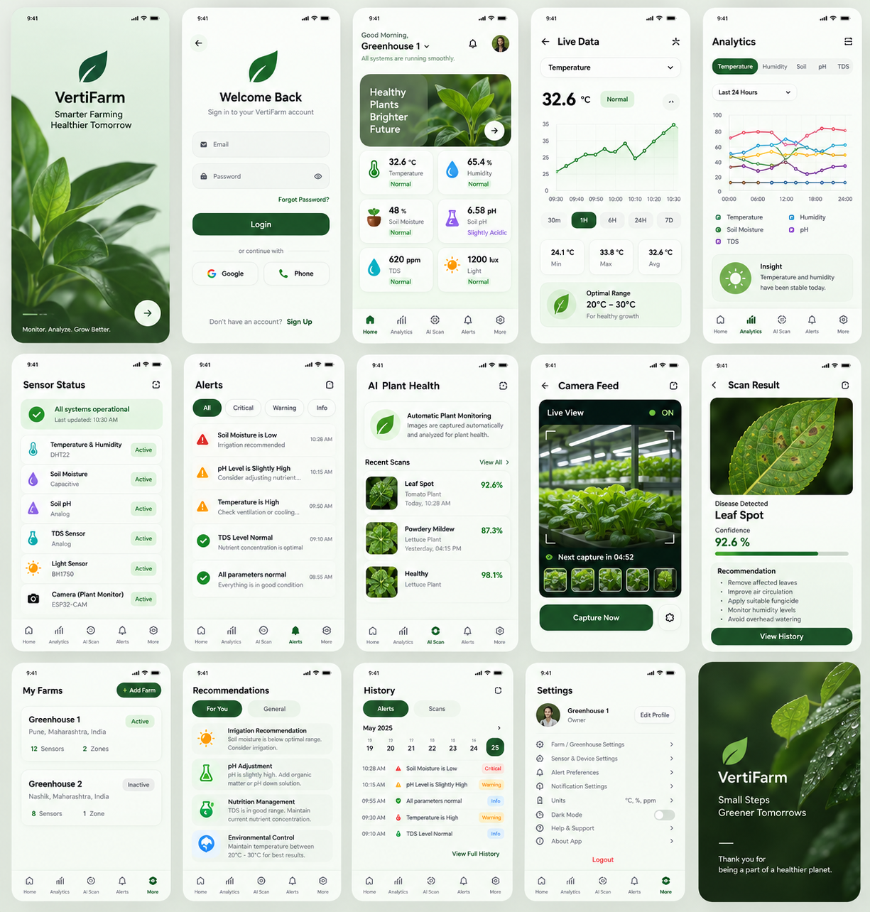
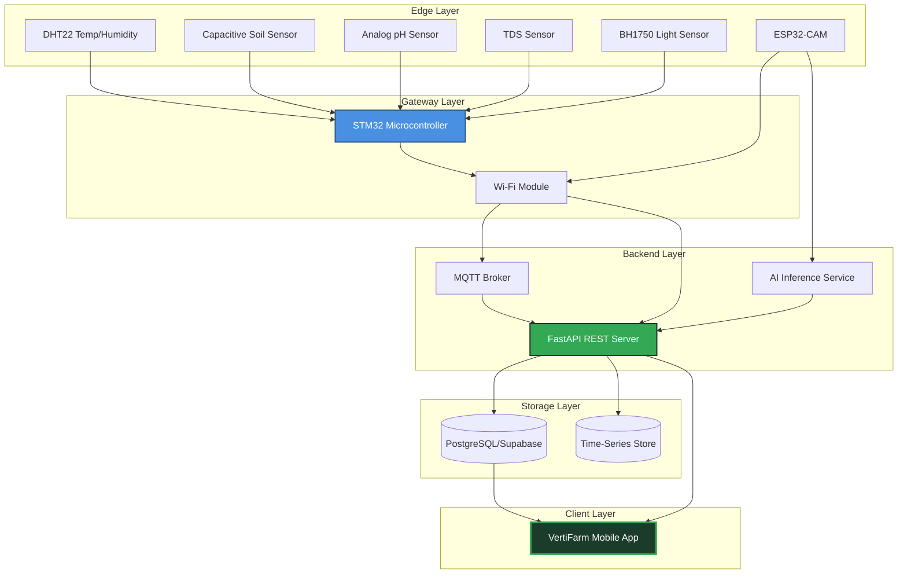

# 🌱 VertiFarm

> **Smarter Farming. Healthier Tomorrow.**

VertiFarm is a mobile-first IoT + AI platform for precision vertical farming. Monitor environmental conditions in real-time, receive intelligent alerts, analyze trends, and detect plant diseases—all from a unified mobile experience.

---

## ✨ What is VertiFarm?

VertiFarm connects STM32-based edge sensors, ESP32 cameras, and AI-powered plant health detection into a comprehensive monitoring and automation platform for vertical farms. Built for agronomists, farm managers, and agricultural researchers who demand real-time insights and actionable intelligence.

**Core Capabilities:**
- **Real-time Telemetry:** Continuous monitoring of 6 critical environmental parameters
- **Intelligent Alerts:** Severity-based notifications with actionable recommendations
- **Trend Analytics:** Historical data visualization and pattern recognition
- **AI Plant Health:** Computer vision-based disease detection with confidence scoring
- **Multi-Farm Management:** Centralized oversight across multiple greenhouse zones
- **Edge-to-Cloud Architecture:** Low-latency sensor data pipeline with cloud persistence

---

## 🚀 Features

### Environmental Monitoring
- 🌡️ **Temperature** — Real-time thermal monitoring with optimal range tracking
- 💧 **Humidity** — Relative humidity measurement for climate control
- 🌾 **Soil Moisture** — Capacitive sensing for irrigation optimization
- 🧪 **pH Level** — Soil acidity/alkalinity monitoring
- ⚗️ **TDS (Total Dissolved Solids)** — Nutrient concentration tracking
- ☀️ **Light Intensity** — PAR/Lux measurement for photosynthesis optimization

### Smart Alerts
- Severity-based classification (Critical, Warning, Info)
- Threshold breach detection with current vs. optimal comparisons
- Actionable recommendations per alert type
- Historical alert timeline

### Analytics Dashboard
- Multi-metric trend visualization
- 24-hour, 7-day, and 30-day views
- Min/Max/Average statistical summaries
- Optimal range indicators

### AI Plant Health
- Camera-based plant disease detection
- Confidence-scored predictions
- Treatment recommendations
- Scan history tracking

### Sensor & Farm Management
- Device status monitoring (Active/Warning/Offline)
- Multi-zone farm organization
- Sensor addition and configuration
- Live camera feeds

---

## 📱 Product Preview

<p align="center">
  
</p>

*Complete application flow: Authentication → Dashboard → Live Data → Alerts → Analytics → AI Scan → Settings*

---

## 🧠 Architecture



**Data Flow:**
1. **Sensors** → STM32 samples environmental parameters every 30s
2. **Gateway** → Wi-Fi module publishes telemetry via MQTT + REST
3. **Backend** → FastAPI ingests, validates, and stores time-series data
4. **AI Service** → Processes ESP32-CAM images for disease detection
5. **Mobile App** → Real-time subscriptions + REST queries for UI updates

---

## 🛠 Tech Stack

| Layer | Technologies |
|-------|-------------|
| **Mobile** | React Native 0.86, Expo SDK 57, TypeScript 6.0, Expo Router |
| **Backend** | FastAPI, PostgreSQL/Supabase, MQTT (Mosquitto), Redis (caching) |
| **IoT Edge** | STM32 (C/C++), ESP32 (Arduino), MQTT, Wi-Fi |
| **AI/ML** | Python, TensorFlow/PyTorch, OpenCV, FastAPI inference endpoints |
| **Infrastructure** | Docker, GitHub Actions, Supabase (backend-as-a-service) |

---

## 📂 Project Structure

```
farm-app/
├── app/                          # Expo Router navigation
│   ├── (auth)/                   # Authentication flow (splash, login, signup)
│   ├── (tabs)/                   # Bottom tab navigation (5 main screens)
│   ├── live-data/[metric].tsx    # Dynamic metric detail view
│   ├── alerts/[id].tsx           # Alert detail screen
│   ├── sensors/                  # Sensor management
│   ├── ai/                       # AI camera & scan results
│   └── ...                       # Additional stack screens
│
├── components/                   # Reusable UI components
│   ├── ui/                       # Design system primitives (Button, Card, Badge)
│   ├── cards/                    # Sensor cards, alert cards
│   ├── charts/                   # Custom SVG charts
│   └── sensors/                  # Sensor-specific components
│
├── constants/                    # Design system tokens
│   ├── colors.ts                 # Brand palette + status colors
│   ├── typography.ts             # Font hierarchy
│   ├── spacing.ts                # Spacing scale
│   └── radii.ts                  # Border radius values
│
├── data/mock/                    # Mock data for development
│   ├── mockSensors.ts            # 6 sensor devices
│   ├── mockTelemetry.ts          # Time-series mock data
│   ├── mockAlerts.ts             # Sample alerts
│   └── ...
│
├── services/                     # Service abstraction layer
│   ├── sensorService.ts          # Telemetry & device management
│   ├── alertService.ts           # Alert handling
│   ├── farmService.ts            # Farm CRUD operations
│   └── aiService.ts              # AI scan management
│
├── types/                        # TypeScript domain models
│   └── index.ts                  # Interfaces for Farm, Sensor, Alert, etc.
│
└── assets/                       # Static assets (images, fonts)
```

---

## ⚡ Getting Started

### Prerequisites

- **Node.js** v24.16.0+ (LTS)
- **npm** 11.13.0+
- **Expo Go** app (for mobile preview) or Android/iOS emulator

### Installation

```bash
# Clone the repository
git clone https://github.com/25Pradnyesh/vertifarm-app.git
cd vertifarm-app

# Install dependencies
npm install

# Start the Expo development server
npx expo start
```

### Running the Application

**Option 1: Expo Go (Mobile Device)**
```bash
npx expo start
# Scan the QR code with the Expo Go app
```

**Option 2: Web Browser**
```bash
# Install web dependencies first
npx expo install react-dom react-native-web

# Start web server
npx expo start --web
```

**Option 3: Android Emulator**
```bash
npx expo start --android
```

**Option 4: iOS Simulator (macOS only)**
```bash
npx expo start --ios
```

### TypeScript Validation

```bash
npx tsc --noEmit
```

---

## 🗺 Roadmap

| Phase | Status | Focus |
|-------|--------|-------|
| **Phase 1** | ✅ Complete | Foundation — Navigation, design system, mock data, TypeScript architecture |
| **Phase 2** | 🚧 In Progress | UI polish, SVG charts, loading states, screen completion |
| **Phase 3** | 📋 Planned | Backend integration — FastAPI REST endpoints, authentication, real-time subscriptions |
| **Phase 4** | 📋 Planned | IoT connectivity — MQTT integration, STM32 firmware, real-time telemetry |
| **Phase 5** | 📋 Planned | AI integration — ESP32-CAM feed, disease detection model, inference service |
| **Phase 6** | 📋 Planned | Production deployment, performance optimization, beta testing |

---

## ⚠️ AI Disclaimer

**Important Notice:**  
The AI-powered plant health detection feature provides **assistive recommendations only** and is not a substitute for professional agricultural diagnosis. Disease predictions are probabilistic and should be validated by qualified agronomists or plant pathologists before taking corrective action.

**Accuracy Limitations:**
- Model predictions depend on image quality, lighting, and camera positioning
- Confidence scores indicate statistical likelihood, not diagnostic certainty
- Novel diseases or edge cases may not be recognized
- Environmental factors can influence prediction accuracy

**Recommended Use:**  
Use AI scan results as an early warning system and decision-support tool, not as the sole basis for treatment decisions.

---

## 📄 License

This project is part of a final-year engineering IoT project and is intended for educational and research purposes.

---

## 👨‍💻 Author

**Pradnyesh**  
Agricultural IoT & Mobile Development

---

## 🌍 Contributing

This is currently a private academic project. Contributions are not being accepted at this time.

---

## 📧 Contact

For inquiries related to this project, please reach out via GitHub.

---

**Built with ❤️ for smarter farming and a healthier tomorrow.**
